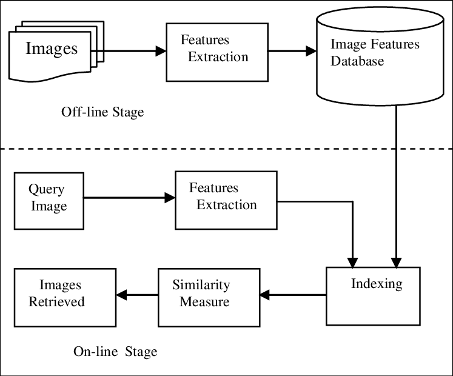
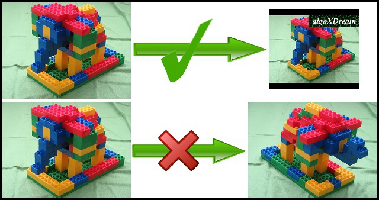

# Near-duplicated Image Retrieval
Dataset: simulated dataset

### Image Retrieval System
 

### Near-duplicated Image
 

1. Extract Image Feature
```python extract_simulated.py```
2. Get average rank
```python get_rank_simulated.py```